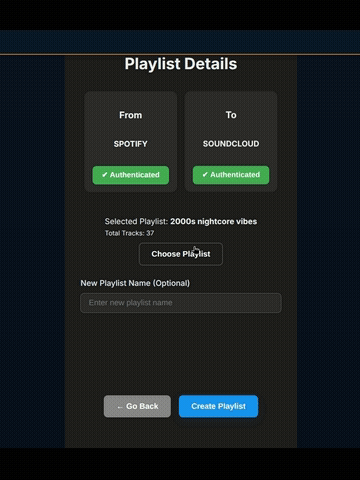
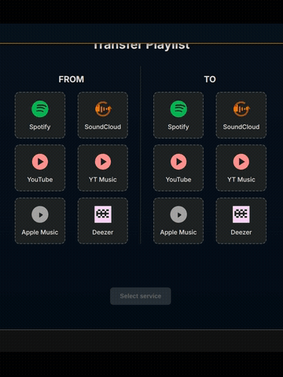

# UNI Playlist Transfer


A full-stack web application for seamless playlist migration between multiple streaming platforms.  
This project provides a fast, secure, and reliable way to transfer your music playlists, ensuring your favorite tunes follow you wherever you go.

---

## 🚀 Live Demo
Experience the live application here: [UNI Playlist Transfer on Vercel](https://uni-playlist-transfer.vercel.app/)

---

## ✨ Key Features
- **Optimized Music-Matching Algorithm**: Uses fuzzy matching, ISRC codes, and duration comparisons for high transfer accuracy.  
- **Secure Authentication**: OAuth2 with encrypted token storage for maximum privacy.  
- **Scalable Backend Architecture**: Spring Boot, PostgreSQL, and Redis caching for efficient large-scale transfers.  
- **Containerized for Consistency**: Core services packaged with Docker for smooth development and deployment.  
- **Responsive Cross-Platform UI**: React + TypeScript frontend works seamlessly across devices.  
- **Thoroughly Tested**: Backend covered with JUnit and Mockito tests for reliability.  

## 🧠 Music-Matching Algorithm
The core of this application is a sophisticated music-matching algorithm designed to achieve the highest possible accuracy when transferring playlists. The process involves two main stages: Query Construction and Scoring & Matching.

**1. Query Construction**
Instead of using a generic search query for all platforms, the algorithm constructs a unique, optimized query for each target service (e.g., Spotify, YouTube). This is crucial because each platform's search API behaves differently and prioritizes different metadata.

- **Trustworthy Platforms**: For platforms with reliable metadata like **Spotify** and **Deezer**, the query is built using a combination of the song title, artist, and album.

- **Other Platforms**: For platforms where metadata can be less structured, like **YouTube** and **SoundCloud**, the query is a normalized version of the track name.

This platform-specific approach ensures that the initial search results from the target platform's API are as relevant as possible, which is the foundation for accurate matching.

**2. Scoring & Matching**
Once the search results are retrieved, each potential match is scored against the original song based on a weighted system. This scoring system is designed to mimic human intuition by prioritizing the most reliable identifiers.

The scoring is based on the following factors, with bonuses for strong indicators and penalties for mismatches:

- **ISRC Match**: The highest bonus is awarded for an exact match of the **International Standard Recording Code (ISRC)**, as this is a unique identifier for a specific recording.

- **Title, Artist, and Album**: A combination of **fuzzy matching** and **Jaccard** similarity is used to score the similarity of the song title, artist, and album. Exact matches receive a significant bonus, while mismatches incur a penalty.

- **Duration**: A large bonus is given for an exact duration match, with a smaller bonus for durations within a close tolerance (e.g., +/- 5 seconds). Significant deviations in duration result in a penalty.

- **Keyword Matching**: The algorithm extracts keywords from the song's metadata (like "live", "remix", "acoustic") and awards a bonus for each overlapping keyword between the source and the potential match.

- **Music Indicators**: For platforms like YouTube, a bonus is given if the video description contains keywords like "music" or "song" as these are strong indicators of an official audio track.

The song with the highest total score is selected as the best match, ensuring a highly accurate and reliable playlist transfer.

---
---
> ⚡ Improved Track-Matching Accuracy: Compared to simple track name searches, my custom algorithm increases playlist migration success by 110%.
---
---
> ⚡ Performance Optimization: Playlist searches are parallelized across multiple threads, allowing multiple songs to be queried simultaneously on each platform, reducing transfer time by more than 60% for large playlists.
---

## 🎥 App Preview
Main transfer process demo:  


Additional preview (UI/feature demo):  


---

## 🎶 Supported Streaming Platforms
- Spotify  
- YouTube  
- YouTube Music  
- SoundCloud  
- Deezer   (app auth not granted)

---

## 🛠️ Technologies Used

### Frontend
- **Framework**: React + TypeScript  
- **Build Tool**: Vite  
- **Routing**: React Router  
- **HTTP Client**: Axios  
- **Fuzzy Search**: Fuse.js  

### Backend
- **Framework**: Spring Boot  
- **Language**: Java 21  
- **Database**: PostgreSQL  
- **Caching**: Redis  
- **Authentication**: JWT (jjwt)  
- **Containerization**: Docker  

---

## 📦 Getting Started

### Prerequisites
- Java 21 (JVM)  
- Node.js & npm  
- PostgreSQL & Redis instances running  
- Configured `application.properties` file for backend  
- Configured `.env` file for frontend  

---

### Installation & Setup

#### Clone the repository
```bash
git clone https://github.com/lukichoooo/uni-playlist-transfer.git
```


Build and run the backend:
```bash
cd Backend/PlaylistConverter
mvn clean install
mvn spring-boot:run
```

Install and run the frontend:
```bash
cd ../../Frontend/PlaylistConverter
npm install
npm run dev
```

### Contact

Email: khundadzeluka702@gmail.com

GitHub: lukichoooo
